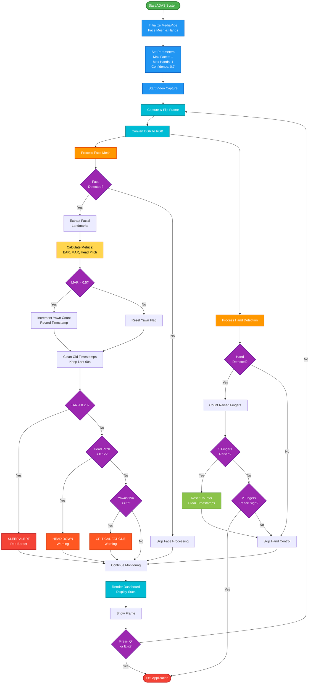

##  $${\color{blue}Advanced \space Sleep \space Detection \space ADAS \space \space System } $$
A real-time Advanced Driver Assistance System (ADAS) that monitors driver fatigue and drowsiness using computer vision and machine learning. The system tracks facial landmarks, eye closure, yawning frequency, and head position to alert drivers when they show signs of fatigue.   

  
 ### $${\color{blue}Features \space :} $$   

* $${\color{lightgreen}Real-time \space Eye \space Monitoring \space :} $$  Detects eye closure using Eye Aspect Ratio (EAR)
* $${\color{lightgreen}Yawn \space Detection \space :} $$   Tracks yawning frequency using Mouth Aspect Ratio (MAR)
* $${\color{lightgreen}Head \space Position \space  Tracking \space :} $$  Monitors head tilt and downward movement
* $${\color{lightgreen}Fatigue \space Alerts  \space :} $$  Visual warnings when critical fatigue patterns are detected
* $${\color{lightgreen}Hand \space Gesture \space Controls \space :} $$  

  * 🖐🏻 Open hand (5 fingers) - Reset counters
  * ✌🏻 Peace sign (2 fingers) - Exit application

* $${\color{lightgreen}Live \space Dashboard\space :} $$   Real-time statistics display with transparent overlay
 ### $${\color{blue}Project  \space Structure :} $$  
  

 ### $${\color{blue}Alert  \space System :} $$        

| Alert Type | Trigger Condition (Threshold) | Visual Indicator (UI) |
| :--- | :--- | :--- |
| **Sleep Alert** | Eye closure (EAR < 0.20) | Red border + "SLEEP ALERT" text | 
| **Head Down** | Head pitch low (< 0.12) | Orange "HEAD DOWN" warning |
| **Critical Fatigue** | 5+ yawns per minute | Orange "CRITICAL FATIGUE" warning |   

### *Requirements*      
```diff
- Python 3.7+ : (The Best version for Use OpenCV and MediaPipe is Python 3.11)
- Opencv : (Version 4.12.0.88)
- MediaPipe : (0.10.14)
```

## $${\color{blue}Installation } $$ 
###  $${\color{lightgreen}Clone  \space this \space repository  \space :} $$ 
```bash
git clone https://github.com/youness372/Advanced-Sleep-Detection-ADAS-System.git
cd Advanced-Sleep-Detection-ADAS-System
```
### $${\color{lightgreen}Install \space the \space required \space  dependencies \space  :} $$  
```bash
pip install opencv-python mediapipe
```
### $${\color{lightgreen}Usage\space :} $$ 
  * Run the application:   
```bsh
python Advanced-Sleep-Detection-ADAS-System.py
```
#### $${\color{lightgreen}Controls \space :} $$   
```diff
- Press "q" to quit the application
```

### $${\color{blue}Code \space Structure } $$ 




